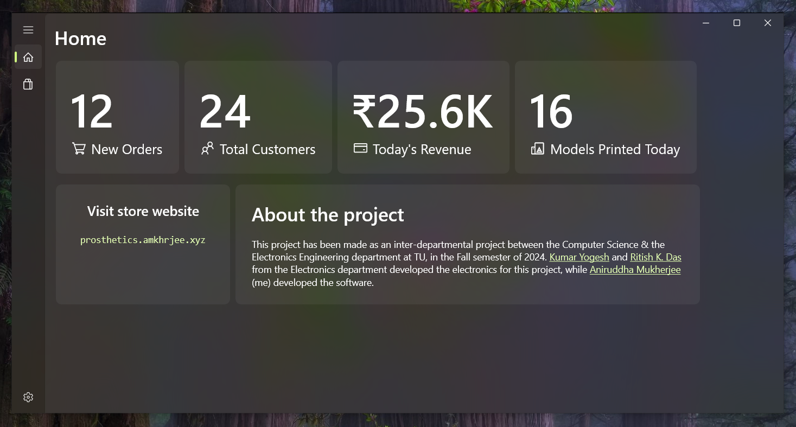
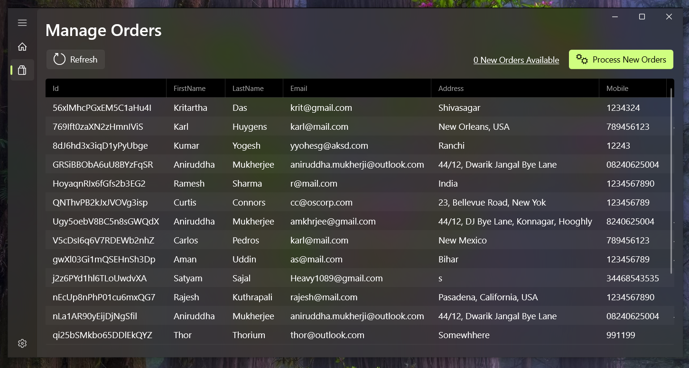
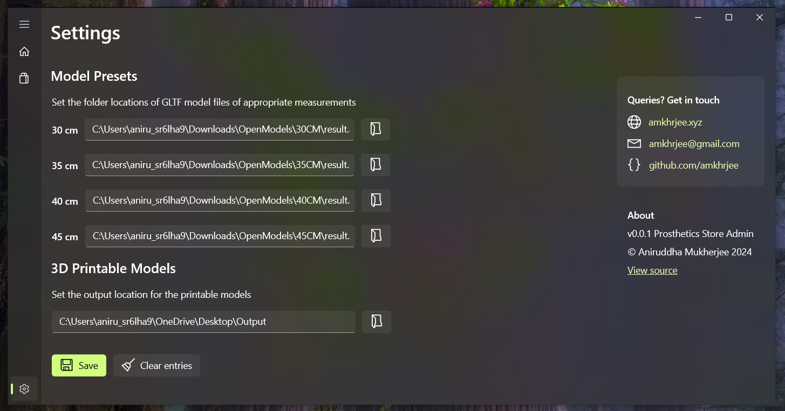

# Prosthetics Store Admin App

This is a native Windows client made with WinUI3 for processing and generating  prosthetics models ordered at [prosthetics.amkhrjee.xyz](https://prosthetics.amkhrjee.xyz). 

This app allows the user to create the ordered models for printing at the press of one button.

> [!NOTE]
> This project was made as a part of my Spring '24 semester project at TU. The source for the prosthetics store is hosted at  [`proshandstore`](https//github.com/amkhrjee/proshandstore).

## Screenshots

## Video Demo
A short video demo is hosted on YouTube: https://youtu.be/kD8DI1oQ_7A